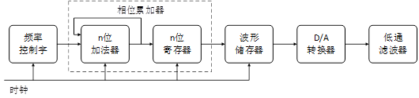
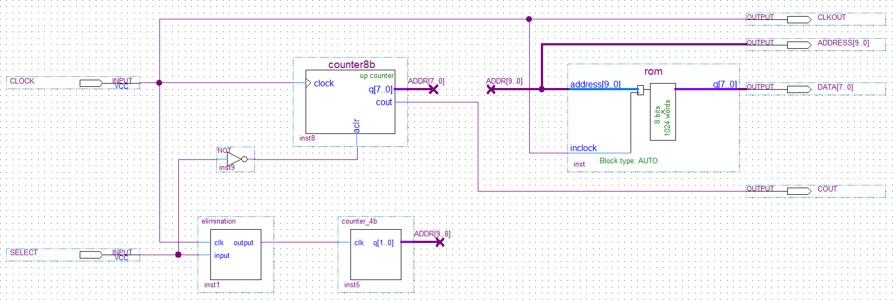
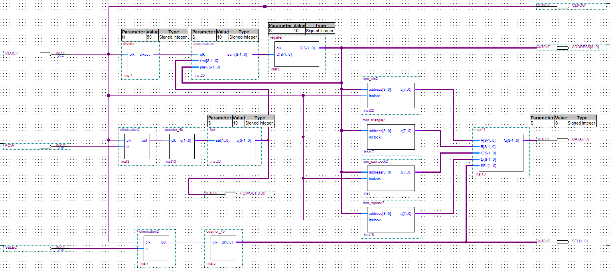
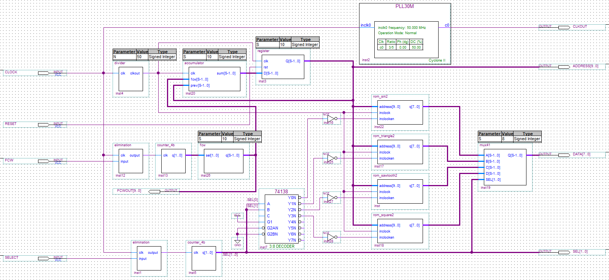
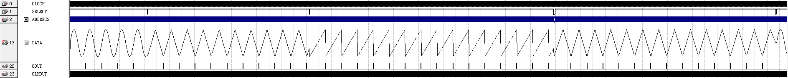
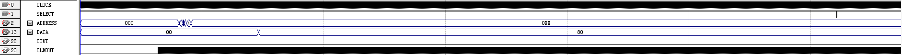
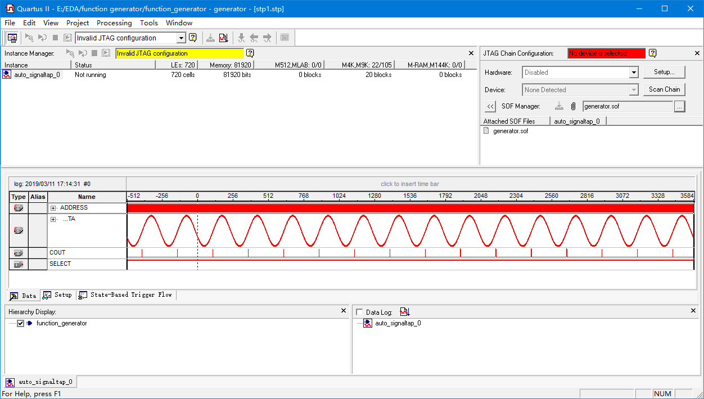
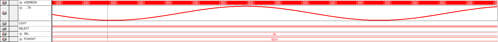
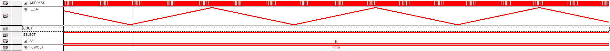
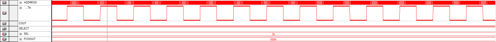

# 函数信号发生器 Function Generator 
信号发生器 (Signal Generator) 是一种能提供各种频率、波形和输出电平电信号的设备。在测量各种电信系统或电信设备的振幅特性、频率特性、传输特性及其它电参数时，以及测量元器件的特性与参数时，用作测试的信号源或激励源。  
它用于产生被测电路所需特定参数的电测试信号。在测试、研究或调整电子电路及设备时，为测定电路的一些电参量，如测量频率响应、噪声系数，为电压表定度等，都要求提供符合所定技术条件的电信号，以模拟在实际工作中使用的待测设备的激励信号。  

信号发生器的实现方法一般有以下几种：
1. 采用电阻、电容、电感以及三极管等分立元件进行设计。
2. 采用晶体管、集成 IC 进行设计。
3. 采用专门的 DDS(Direct Digital Synthesizer，直接数字式频率合成器) 芯片和处理器组合进行设计。
4. 采用 PLD(Programmable Logic Device，可编程逻辑器件) 如 FPGA、CPLD 为核心进行设计。

几种方法相比较之下，使用方法 4，即利用 DDS 原理，采用FPGA开发多功能函数信号发生器是最佳选择，与方法 3 的 DDS 芯片相比，FPGA开发成本更低，操作更加灵活，还能根据需求及时更新配置。

## 系统的组成
DDS(Direct Digital Synthesizer) 即直接数字合成器，是一种新型的频率合成技术。具有较高的频率分辨率，可以实现快速的频率切换，并且在改变时能够保持相位的连续，很容易实现频率、相位和幅度的数控调制。因此在现代电子系统及设备的频率源设计中，尤其在通信领域，直接数字频率合成器的应用尤为广泛。  
一个基本的 DDS 结构，主要由相位累加器、相位调制器、波形 ROM 查找表和 DAC(Digital To Analog Converter) 构成。  

## 系统的总体设计
### 第一次设计

* **CLOCK**：芯片 EP2C35F484C8 提供的 50MHz 的时钟，不可调。
* **CLKOUT**：DAC的采样时钟。
* **ADDR[9..0]**：选择 ROM 内地址，ADDR[7..0] 由 8 位二进制加法计数器提供，ADDR[9..8 ]由 2 位二进制加法计数器提供。
* **SELECT**：功能选择信号，按键按下计数，经过消抖，使两位加法计数器计数。
* **q[1..0]**：两位加法器的输出信号，q[1..0] 作为 ADDR[9..8]，选择输出波形类型，00 为正弦波，01 为三角波，10 为锯齿波，11 为方波。
* **ROM 内数据**：000H~0FFH 正弦波；100H~1FFH 三角波；200H~2FFH 锯齿波，300H~3FFH 正方波。
* **ADDRESS[9..0]**：查看输入的地址是否正确，输出到发光二极管查看。
* **DATA[7..0]**：从 ROM 读取出的数据，将送入 DAC 输出模拟信号。
* **COUT**：8位计数器的输出信号，每计数256次产生一次高电平。

### 第二次设计

* 将四种波形的数据分成了 4 片 ROM 来储存。
* 采用四选一多路选择器控制输出波形。
* 加入频率控制字模块，可通过频率控制字$F_{cw}$来改变输出波形频率。

### 第三次设计

* ROM 加上时钟使能信号，解决资源浪费问题。
* 4 片 ROM 模块由 3-8 译码器控制。
* 3-8 译码器受 SELECT 信号输入控制。
* **RESET**：使计数器清零，相当于清零信号的相位。
* 引入嵌入式锁相环，将 50MHz 的时钟分频为 30MHz 的时钟。(DAC 芯片 TLC5602 的最大采样频率为 30MHz)

## 系统测试
### 功能仿真

### 时序仿真

可能是因为工作频率太高，时序仿真的结果是完全异常的。

### 实机测试
将程序烧入 FPGA 中，使用 Signal Tap II 进行采样：

采样结果如下：

